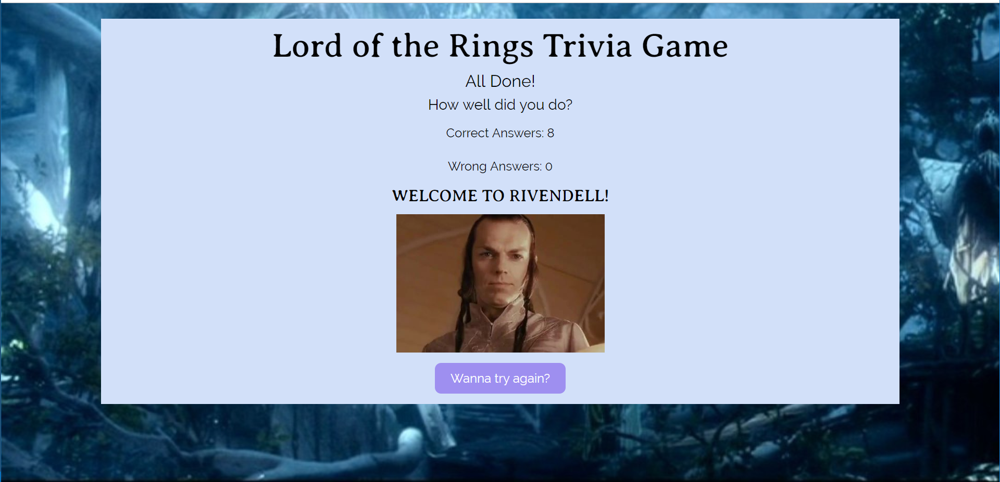

# Lord of the Rings Trivia Game

This game gives the player 60 seconds to answer 8 trivia questions based on Peter Jackson's adapation of J.R.R. Tolkien's **The Lord of the Rings**.

Play the game here => [https://steeshmck.github.io/Lord-of-the-Rings-Trivia-Game/](https://steeshmck.github.io/Lord-of-the-Rings-Trivia-Game/)

# Overview

All of the game's content is contained on one html page, with divs hidden and shown, via jQuery, when required by game play. The code that operates the game is written in a modular fashion, making the path of the code easy to follow.

# Instructions

The app opens with a welcome page. 

When the user presses the button labeled **Enter!**, the page presents the 8 multiple-choice trivia questions, and the timer begins to countdown from 60.

Answers are chosen via radio button. If the user answers all 8 questions before the time is up, they need to push the **DONE!** button to see how many questions they answered correctly. If the user got 5 or more questions correct, the page changes to show an image of Lord Elrond and the number of questions answered correctly.

If the user gets 4 or fewer questions correct, then the page shows an image of the ringwraiths and the number of wrong and right questions.

If the timer runs out before all of the questions are answered, then the page shows an image of Gandalf.

All ending pages offer the player the opportunity to start over from the beginning by pressing a labeled button. All of these buttons take the user back to the welcome page.
